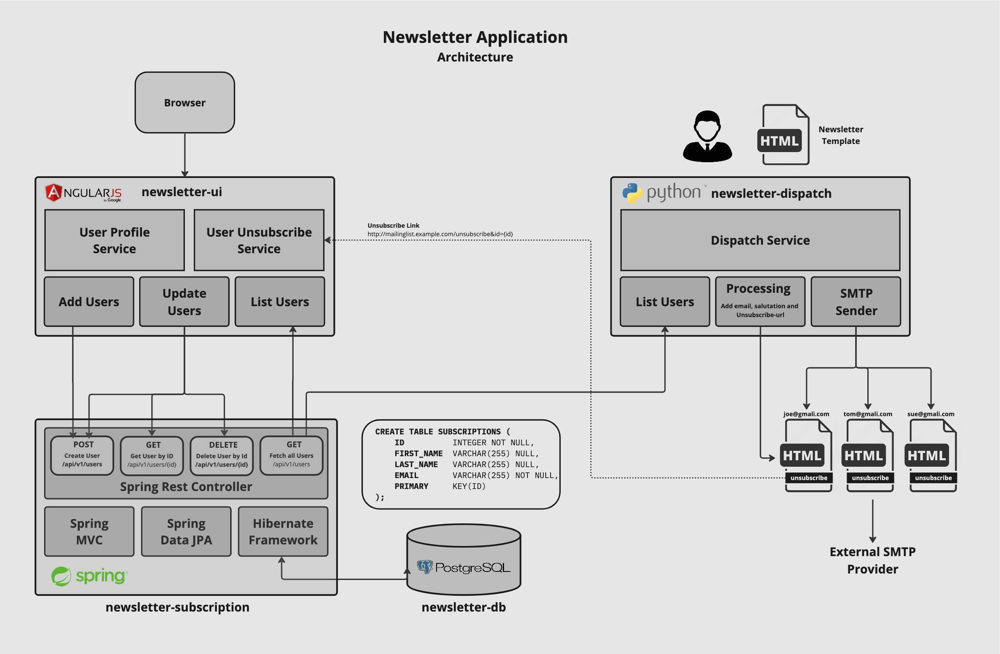

# Newsletter Application - A Spring Boot / AngularJS / PostgreSQL CRUD showcase

This Project has been designed as a demo application for the Tanzu Applicaiton Platform (TAP). Its
microservice architecture consists of the Newsletter WebUI (newsletter-ui) written in AngularJS, the 
Subscription Service (newsletter-subscription) based on Spring Boot and a PostgreSQL database as a backend
(newsletter-db). 

The picture below shows the architecture of the Newsletter Application:

### Applicaiton Components
- Newsletter User Interface (newsletter-ui)
- Newsletter Subscription Service (newsletter-subscription)
- Newsletter Database (newsletter-db)
- Newsletter Mailing Service (newsletter-mailing-service)

## Newsletter User Interface (newsletter-ui)
The Newsletter User Interface is a Web Frontent based on AngularJS that allows user to signup to the Newsletter. The Interface has full CRUD capability. It allows users to register themselves to the Newsleter Service and modify or delete their data records afterwards. The Newsleter User Interfaces interacts with the API provided Newsleter User Service to abstract direct connection to the Newsletter User Database. 

## Newsletter Subscription Service (newsletter-suscription)
The Newsletter Subscription Service is the Backend of the Newsletter User Interface and provides an RestFUL interface for the application components 
(newsletter-ui or the mailing-service) to interact with the APIs. The the Newsletter User Service uses a PostgreSQL database backend to store user data records. This abstraction allows better controll who is acessing the service. New service features can be implemented 
by introducting a new API Version. Its planned to integrate a circuit breaker with the Newsleter User Service in a fulure (backup) version to prevent 
the service from overloading.

## Newsletter Database (newsletter-db)
The Newsletter Database acts as backend for the Newsletter User Service and is based on a PostgreSQL Database running in a container with 
the same Kubernetes Namespace as the application. The Database is deployed and managed trough the PostgreSQL Operator running in the default namespace
of the same cluster. More information about the VMware PostgreSQL Operator can be seen in the documentation 
[VMware SQL with Postgres for Kubernetes Operator](https://docs.vmware.com/en/VMware-SQL-with-Postgres-for-Kubernetes/2.0/vmware-postgres-k8s/GUID-install-operator.html).

## Newsletter Mailing Service (newsletter-mailing-service)
The Newsletter Mailing Service is a Phyton based application started by the Newsletter Administrator to generate a mass mailing to the Newsletter 
registered users provided by the Newsletter User Service API. The Newsletter Mailing Service processes the provided Newsletter template and inserts the users salutation, email address and unsuscribe-url basing on the registered user-id. The mails will then be sent to the configured external 
Mail Service Provided via SMTP.

Deployment Scenarios
The Newsletter application can be deployed local on a Workstation / Laptop which is usually the first choice of a developer with the following limitation: Backendsystems (database etc.) require to be simulated to procect the API's which can not be accessed on a local environent. The second 
deployment option is on top of kubernetes cluster deployed with Tanzu Applicaiton Platform (TAP) that automaticly generates a supply chain depending 
on the applicaiotn needs. 
- Deploy on the local Laptop/Workstation
- Deploy on Kubernetes with Tanzu Applicaiton Platform (TAP)

## Setup Development Environment
### Create GitHub API Key
- Navigate to https://github.com/settings/profile
- Navigate to 'Developer Settings' in the Side Bar at the bottom
- Select 'Personal access tokens' and 'Token (classic)'
- Select 'Generate new Token (classic)"
- Enter a Name and Select Access for 'Repo' then hit 'Generate Token'

